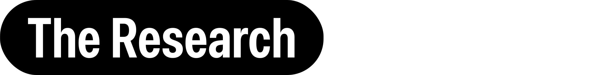
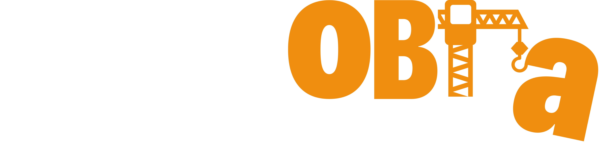

# Hi there 👋

I'm **Cristian**, a full-stack developer based in **Valencia, Spain 🇪🇸**.

I enjoy building software that solves real problems, whether it's a web platform, a mobile app, or a developer tool. I'm always exploring new technologies and pushing myself to learn something new. As I like to say:

  

---

## 🚀 Tech Stack

**Languages**

  
  

**Frontend**

  
  
  
  
  
  

**Mobile**

  
  

**Backend**

  
  
  

**DevOps & Tools**

  
  
  

---

## 💡 What I'm Interested In

* 🌐 Web Development
* 📱 Mobile App Development
* 🎮 Game Development
* 🔬 Research & Experimentation
* 🧠 Developer Productivity

## 🛠 Projects

---

### 🧱 Manobra

  

A construction marketplace that connects workers, companies, and clients in one platform. It includes authentication, real-time messaging, project management, reviews, and role-based access.

  
  
  
  
  
  

---

### 📡 DevCoach

  

A VS Code extension that acts as your coding companion. It tracks your coding sessions, helps you build healthier programming habits, and provides productivity insights with real-time reminders.

  

---

### 🚗 PlatePing

  

A real-time platform for vehicle plate tracking and notifications. Designed to detect and alert users about specific license plates with fast backend processing and mobile-first notifications.

  
  
  
  

---

## 📫 Reach Me

* 📧 **Email:** [cibucristi1@gmail.com](mailto:cibucristi1@gmail.com)
* 📷 **Instagram:** @cristiancibuu

---

## ☕ Not So Fun Fact

I have a habit of turning random ideas into projects at 2 AM. Some stay experiments, some become products, but I always end up learning something new.
